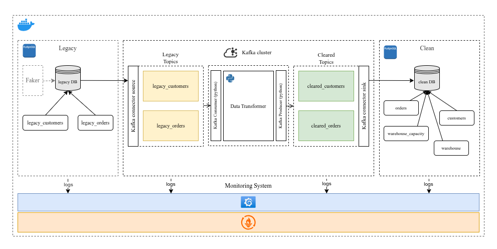
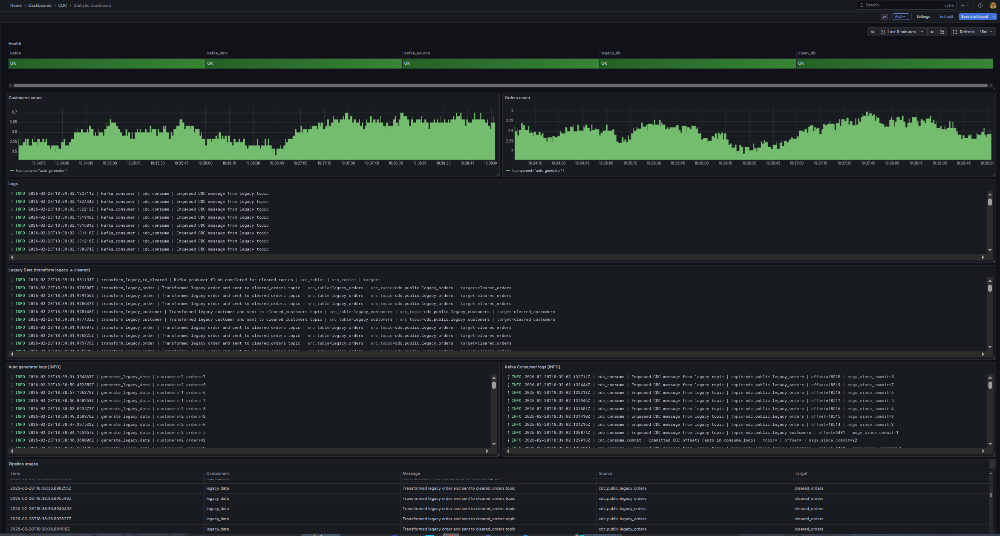

# What is this and why does it exist

Imagine you have an old PostgreSQL database that nobody wants to touch because something might break. But your analytics team needs fresh data — not once a day through a risky cron job, but continuously.

This project solves that problem. It listens to real-time changes in a legacy database, cleans and transforms the data, and writes it into a separate analytics-ready database. You don’t need to modify the source system, and you can see everything that happens in the pipeline at any moment.

The architecture is intentionally similar to a real production system: Kafka for buffering, Debezium for CDC, a transformation service, a target database, and full monitoring. Even if something fails, the pipeline recovers without losing data.
&nbsp;


## Tech stack

- PostgreSQL (legacy + analytics)
- Debezium (CDC via logical replication)
- Kafka + Kafka Connect (JDBC Sink)
- FastAPI (transformation service)
- Docker Compose
- Grafana + Prometheus + Loki (monitoring & logs)

&nbsp;

# 📌 Architecture Overview




# Main parts

### 🔵 Legacy PostgreSQL + Debezium

The source system consists of two tables: legacy_customers and legacy_orders.
Debezium connects via logical replication (WAL) and streams every INSERT / UPDATE event into Kafka in real time.
No changes to application code are required — only wal_level = logical.

&nbsp;
---
### 🟠 Kafka – Transport & Buffering
Kafka acts as the transport layer and provides durability and buffering.

#### Topics used:
* cdc.public.* — raw CDC events from Debezium
* cleared_customers / cleared_orders — cleaned, transformed events

Raw topics are never mutated. If the transformer goes down, data stays safe in Kafka until the service recovers.

&nbsp;
---
### 🟢 FastAPI Transformer

#### A custom transformation service that:
* manually consumes CDC events using confluent-kafka
* splits full_name → first_name + last_name
* maps warehouse city → warehouse_id
* commits Kafka offsets only after successful processing
* is fully idempotent (same event processed twice does not break the data)

This service forms the “Silver layer” between raw and clean events.

&nbsp;
---
### 🟣 Kafka Connect JDBC Sink

The final stage of the pipeline.
Connect workers read from cleaned topics and write into:
* clean.customers
* clean.orders

The JDBC Sink supports batching, offset tracking, and schema evolution.

&nbsp;
---
### 🧪 Data Generator

A synthetic load generator that inserts random customers and orders into the legacy database.
This helps simulate real traffic without manual inserts.

&nbsp;
---
### 🛡️ Run Tests
```bash
docker compose -f docker-compose.tests.yml up --build --exit-code-from api_tests
```

&nbsp;
---
### 🚀 Running Locally

```bash
docker compose \
  -f docker-compose.infra.yml \
  -f docker-compose.app.yml \
  -f docker-compose.monitoring.yml \
  up -d --build
```

&nbsp;
---
### 📊 Monitoring & Observability (Grafana + Prometheus + Loki) (http://localhost:3000/dashboards)

The project includes a complete observability stack that mirrors a real production setup:
#### What you get
* Grafana dashboards for Kafka, Connect, and FastAPI
* Prometheus metrics scraping
* Loki for centralized JSON logs (all services)

This provides full visibility into the pipeline — backlog, processing rate, consumer lag, connector status, and service health — making the system easy to debug and safe to operate.


Example:



&nbsp;
---
### ⭐ Key Features

* Real-time CDC pipeline using PostgreSQL WAL + Debezium
* Raw → Clean architecture with idempotent transformations
* Manual Kafka consumer with offset control
* Automatic delivery guarantees via Kafka buffering
* Full observability: Grafana + Prometheus + Loki
* Docker-based infrastructure + tests
